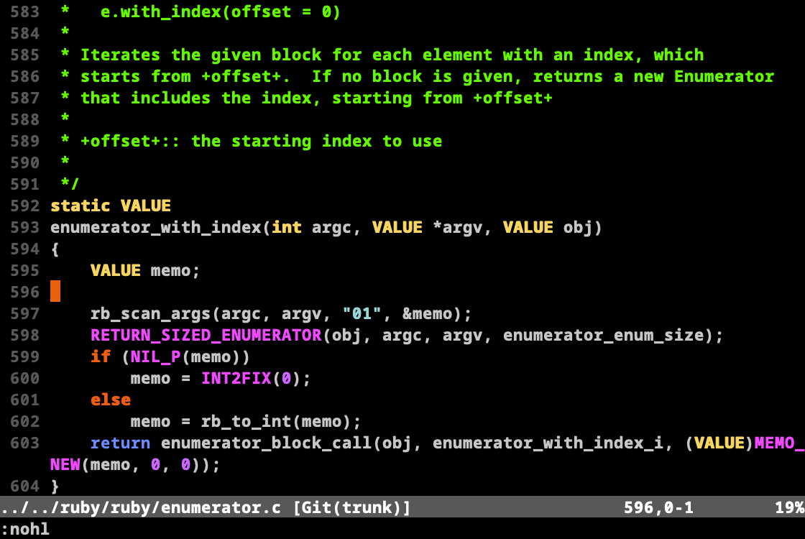

mrkn256.vim
===========

mrkn256 is a colorscheme for vim designed by mrkn.  It is avaiable on 88- and 256-color xterm, and on gvim.

Description
-----------

This is a colorscheme designed by mrkn based on "desert256" colorscheme created by Henry So, Jr.  This colorscheme is designed to work with with 88- and 256-color xterms.

A screen shot is available at <http://img.skitch.com/20100215-rxeg4nguregi8i21dyarspmsgc.png>

The ancestor version "desert256" colorscheme is available at <http://www.vim.org/scripts/script.php?script_id=1243>

The real feature of this colorscheme, with a wink to the "inkpot" theme, is the programmatic approximation of the gui colors to the palettes of 88- and 256- color xterms.  The functions that do this (folded away, for readability) are calibrated to the colors used for Thomas E. Dickey's xterm (version 200), which is available at <http://dickey.his.com/xterm/xterm.html>.

Henry had struggled with trying to parse the rgb.txt file to avoid the necessity of converting color names to #rrggbb form, but decided it was just not worth the effort.  I thank a lot for his results.

Installation
------------

Copy this file into ~/.vim/colors (or $VIM/vimfiles/colors in Windows).  Start it from within vim using :colorscheme mrkn256.

Screenshot
----------

